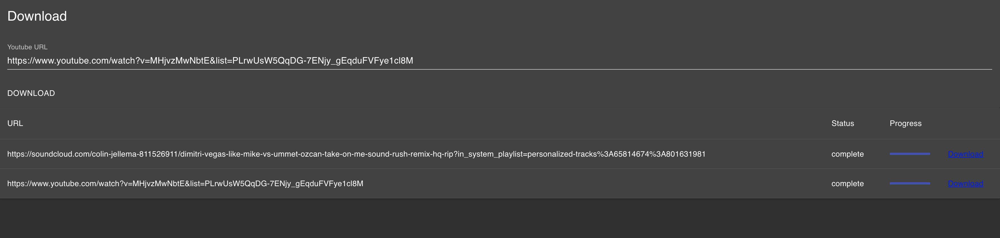

# Youtube Downloader UI



This project uses the [Nx](https://nx.dev) monorepository tools. 

## Prerequisites
* Download and install [youtube-dl](https://youtube-dl.org/) and 
[ffmpeg](https://ffmpeg.org/) and make sure that both tools are
in your ```PATH``` environment variable. youtube-dl is used for downloading
the content and ffmpeg is responsible for converting the videos in the desired 
format.

## Docker Deployment
Create a ```docker-compose.yml``` file with following content
```yaml
version: '3'

services:
  youtube-dl:
    image: agrippa1994/youtube-dl-ui
    command: ["node", "dist/apps/api/main.js"]
    volumes:
      - downloads:/usr/share/app/downloads
    restart: always
    ports:
      - 3333:3333

volumes:
  downloads:
```
and start it with ```docker-compose up -d```. Navigate to the [localhost:3333](http://localhost:3333)
and the deployment should be finished.

## Development
* First install node.js and the yarn package manager.
    ```bash
    npm install -g yarn
    ```
* Checkout this repository and install all dependencies
    ```bash
    yarn install
    ```
* Open two terminals and start the backend in the first one
    ```bash
    yarn start api
    ```
    and the frontend in the second one
    ```bash
    yarn start youtube-dl
    ```
* Navigate with your browser to [localhost:4200](http://localhost:4200) and that's it.

## Roadmap
* Add support for downloading videos in various formats
* Housekeeping of downloads on the server
* Store download information in the browser (local storage) in order to keep download history
